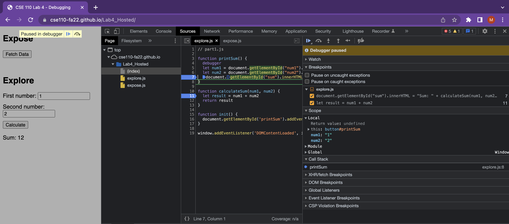
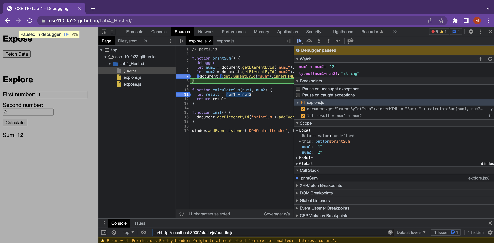
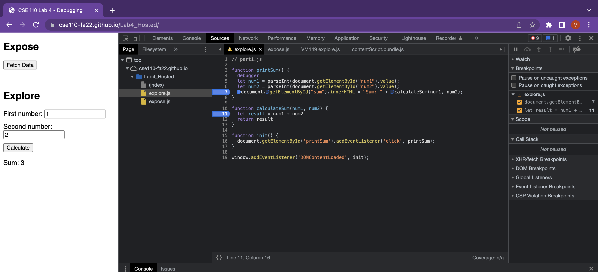

The screenshots are:

1. The bug was that the inputs accepted on the javascript side were taken in as string inputs and the code was concatenating the two strings. 
2. The fix was when we accepted the input, we parse it as integer using `parseInt` and then we pass it onto the calculateSum function.

